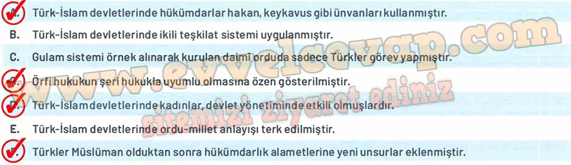

## 10. Sınıf Tarih Ders Kitabı Cevapları Meb Yayınları Sayfa 102

**Soru: 4) Coğrafi ve sosyokültürel koşulların Karahanlı, Gazneli, Büyük Selçuklu ve Türkiye Selçuklu devletlerindeki askerî ve idari teşkilatların gelişimine etkilerini açıklayınız.**

* **Cevap**: Karahanlı, Gazneli, Büyük Selçuklu ve Türkiye Selçuklularında coğrafyanın genişliği ve farklı kültürlerle temas, idari ve askerî teşkilatı geliştirmiştir. Türkistan bozkırlarında göçebe gelenekler sürerken, şehirleşmenin yoğun olduğu bölgelerde saraylar, divan teşkilatı ve atabeylik sistemi gelişmiştir. Ticaret yolları ve yerleşim alanları da ikta sistemi gibi uygulamaları güçlendirmiştir.

**Soru: 5) Türkistan’dan Türkiye’ye uzanan süreçte Türk devlet ve ordu teşkilatlarında meydana gelen değişim ve sürekliliğin veraset sistemi, hakimiyet anlayışı ve hükümdarlık alametleri üzerindeki etkilerini örneklerle açıklayınız.**

* **Cevap**: Veraset sistemi İslamiyet’ten sonra da devam etmiş, devlet hanedanın ortak malı kabul edilmiştir. Hakimiyet anlayışı “kut” inancından “Allah’ın yeryüzündeki gölgesi” anlayışına dönüşmüştür. Hükümdarlık alametlerine hutbe, tuğra, çetr gibi yeni unsurlar eklenmiş; ancak eski unsurlar (taht, tuğ, sancak) da korunarak süreklilik sağlanmıştır.

**Soru: 6) Türkistan’dan Türkiye’ye uzanan süreçte Türk devlet ve ordu teşkilatları ile ilgili aşağıdaki cümlelerden doğru olanların karşısındaki kutucuğu işaretleyiniz.**

**Soru: 7-11. soruları aşağıdaki kaynaklardan yararlanarak cevaplayınız.**

**Kaynak A**

“Aile, toplum olma anlayışının başlangıcını ve temelini oluşturur. Eski Türk toplumunda en küçük birim ailedir. Türk sosyal hayatı, âile(oğuş)ve akrabalık(kadaş)bağları üzerine kurulmuştur.(…) Başta ev olmak üzere ailenin bütün maddi varlığı, eşlerin ortak malı idi. Ailenin her türlü faaliyetinde de iş bölümü anlayışı hakimdi.(…)Türk kadını, eşi ile birlikte ailenin bütün faaliyetlerine katılmaktaydı. Hatta o, erkekler gibi ata binmekte, silah kullanmakta, avcılık yapmakta ve güreş tutmaktaydı. (…) Selçuklu devri Türk ailesinde günlük hayatın büyük kısmı, geçim için gösterilen faaliyetlerle geçmekteydi. .Ailenin geçimi için çalışanların başında baba ve anne gelmekteydi.(…) Eski Türk aile fertleri arasındaki ilişkiler, son derece samimi olup, karşılıklı sevgi, saygı ve bağlılık temeline dayanmaktaydı.(…) Türklerin bir kısmı, Selçuklu devrinde de köylerde, kasabalarda ve şehirlerde oturmaya, kendilerine sabit konutlar yapmaya devam etmişlerdir. Selçuklu devri sabit konutları genellikle kerpiçten (pişmemiş tuğla)yapılmaktaydı.”

* **Cevap**: **Bu etkinliğin cevabı diğer sayfadadır. (Bkz. sayfa 104)**

**10. Sınıf Meb Yayınları Tarih Ders Kitabı Sayfa 102**