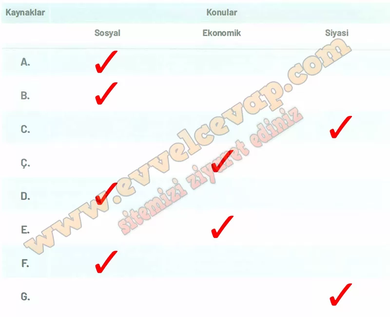

## 10. Sınıf Tarih Ders Kitabı Cevapları Meb Yayınları Sayfa 105

**Soru: 9) Verilen kaynakların hangi konularla ilgili olduğuna dair tablodaki ilgili alanları işaretleyiniz.**

* **Cevap**: A: Sosyal, B: Sosyal, C: Siyasi, Ç: Ekonomik, D: Sosyal, E: Ekonomik, F: Sosyal, G: Siyasi

**Kaynak A**

“Aile, toplum olma anlayışının başlangıcını ve temelini oluşturur. Eski Türk toplumunda en küçük birim ailedir. Türk sosyal hayatı, âile(oğuş)ve akrabalık(kadaş)bağları üzerine kurulmuştur.(…) Başta ev olmak üzere ailenin bütün maddi varlığı, eşlerin ortak malı idi. Ailenin her türlü faaliyetinde de iş bölümü anlayışı hakimdi.(…)Türk kadını, eşi ile birlikte ailenin bütün faaliyetlerine katılmaktaydı. Hatta o, erkekler gibi ata binmekte, silah kullanmakta, avcılık yapmakta ve güreş tutmaktaydı. (…) Selçuklu devri Türk ailesinde günlük hayatın büyük kısmı, geçim için gösterilen faaliyetlerle geçmekteydi. .Ailenin geçimi için çalışanların başında baba ve anne gelmekteydi.(…) Eski Türk aile fertleri arasındaki ilişkiler, son derece samimi olup, karşılıklı sevgi, saygı ve bağlılık temeline dayanmaktaydı.(…) Türklerin bir kısmı, Selçuklu devrinde de köylerde, kasabalarda ve şehirlerde oturmaya, kendilerine sabit konutlar yapmaya devam etmişlerdir. Selçuklu devri sabit konutları genellikle kerpiçten (pişmemiş tuğla)yapılmaktaydı.”

**Soru: 10) Kaynak A’da Türk ailelerinin günlük yaşamdaki iş bölümünden ve sosyoekonomik faaliyetlerinden söz edilmektedir. Bu bilgiler hangi diğer kaynak veya kaynaklarla doğrulanabilir? Açıklayınız.**

* **Cevap**: Kaynak A’daki Türk ailelerinin günlük iş bölümü ve sosyoekonomik faaliyetleri, **Kaynak B** (günlük yaşamdan sahne tasvirleri), **Kaynak C** (halı ve dokumacılık sanatı) ve **Kaynak E** (para basımı ve ekonomik faaliyetler) ile doğrulanabilir. Çünkü bu kaynaklar Türklerin sosyal hayatını, sanat ve zanaatla uğraştıklarını, ekonomik faaliyetlerde bulunduklarını ve kültürel yaşamlarını somut örneklerle göstermektedir.

**Soru: 11) Türklerin ekonomik faaliyetleri, yerleşim bölgelerinin seçimini ve şehirleşme anlayışlarını nasıl etkilemiştir? Tarihsel bağlamı ve coğrafi koşulları göz önünde bulundurarak açıklayınız.**

* **Cevap**: Türklerin tarım ve hayvancılıkla uğraşması, verimli topraklara ve geniş otlaklara sahip bölgeleri yerleşim için tercih etmelerini sağladı. Ticaretle uğraşmaları, İpek Yolu ve önemli ticaret güzergâhları üzerindeki şehirlerin gelişmesine yol açtı. Bu nedenle Anadolu’da Konya, Kayseri, Sivas gibi merkezler büyüyerek cami, medrese, kervansaray ve çarşılarla donatıldı. Böylece ekonomik faaliyetler, hem yerleşim bölgelerinin seçimini hem de şehirleşme anlayışını doğrudan şekillendirdi.

**10. Sınıf Meb Yayınları Tarih Ders Kitabı Sayfa 105**