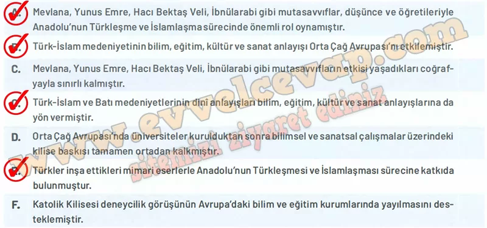

## 10. Sınıf Tarih Ders Kitabı Cevapları Meb Yayınları Sayfa 107

**Soru: 12) Öğrencilerin konuşmalarına göre Türk-İslam ve Batı medeniyetlerinin bilim, kültür, eğitim ve sanat anlayışlarındaki benzerlik ve farklılıklar nelerdir? Aşağıdaki tablonun ilgili alanlarına yazınız.**

**Benzerlikler:**

* Hem Türk-İslam hem de Batı medeniyetinde eğitim kurumları (medrese – üniversite, manastır okulları) kuruldu.
* Bilim, kültür ve sanat alanlarında eserler verilerek insanlığın ortak mirasına katkı yapıldı.
* Dinî değerler, her iki medeniyette de eğitim ve kültür hayatında etkili oldu.

**Farklılıklar:**

* Türk-İslam medeniyetinde bilim, dinî ilimlerle birlikte pozitif bilimlerle de desteklenirken; Batı’da uzun süre skolastik düşünce ve kilisenin baskısı hakimdi.
* Türk-İslam dünyasında tasavvuf ve mutasavvıflar insanlara sevgi, hoşgörü ve birliği aşılamışken; Batı’da kilise çoğu zaman baskıcı bir tutum sergiledi.
* Türkler cami, medrese, kervansaray, sanat eserleriyle Anadolu’yu imar ederken; Batı’da katedraller, manastırlar ve şatolar ön plandaydı.

**Soru: 13) Öğrencilerin konuşmalarından hareketle aşağıdaki yargılardan hangilerine ulaşılabileceğini işaretleyiniz. (Birden fazla cümleyi işaretleyebilirsiniz.)**

**Soru: 14) Medreselerin coğrafi dağılımından yola çıkarak bu kurumların Anadolu’nun Türkleşme ve İslamlaşma sürecine etkilerini açıklayınız.**

* **Cevap**: Medreseler Anadolu’nun farklı şehirlerinde açılarak halkın eğitim ihtiyacını karşılamış ve İslam kültürünü yaymıştır. Bu kurumlar sayesinde hem dinî hem de pozitif bilimler öğretilmiş, toplumda birlik ve ortak değerler güçlenmiştir. Böylece Anadolu’da Türkleşme ve İslamlaşma süreci hız kazanmıştır.

**10. Sınıf Meb Yayınları Tarih Ders Kitabı Sayfa 107**