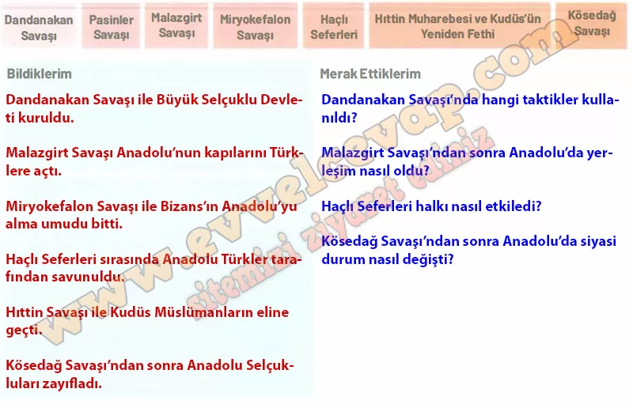

## 10. Sınıf Tarih Ders Kitabı Cevapları Meb Yayınları Sayfa 13

**Keşfedelim**

**Soru: 1040-1299 yılları arasında meydana gelen önemli askerî gelişmeler hakkında verilen formun “Bildiklerim” ve “Merak Ettiklerim” bölümlerini doldurunuz.**

**Öğrenelim**

**Soru: Verilen yönergeler doğrultusunda aşağıdaki etkinlikleri yapınız.**

**Soru: 1040-1299 yılları arasında meydana gelen önemli askeri mücadelelerle ilgili metin, kaynak ve görsellerden yararlanarak soruları cevaplayınız.**

* **Cevap**: **Bu etkinliğin cevabı diğer sayfadadır. (Bkz. sayfa 14)**

**10. Sınıf Meb Yayınları Tarih Ders Kitabı Sayfa 13**