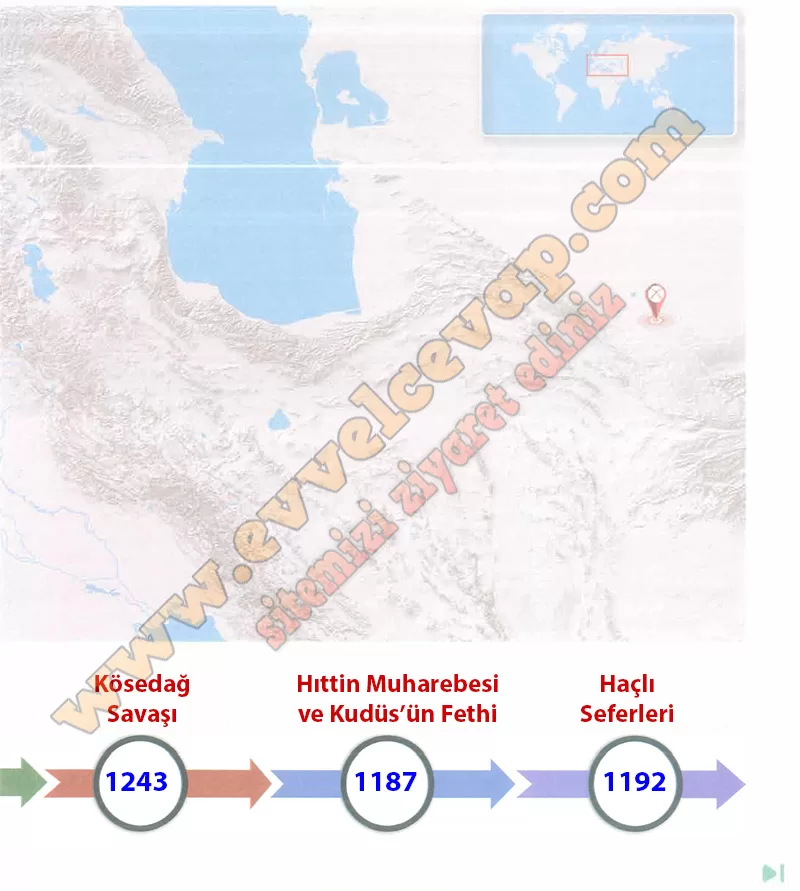

## 10. Sınıf Tarih Ders Kitabı Cevapları Meb Yayınları Sayfa 31

**Soru: Verilen yönergeler doğrultusunda aşağıdaki etkinlikleri yapınız.**

**Soru: Türk tarihinin seyrini değiştiren önemli mücadeleleri dilsiz harita üzerindeki işaretli yerlere ve tarih şeridindeki ilgili alanlara yazanız.**

**10. Sınıf Meb Yayınları Tarih Ders Kitabı Sayfa 31**