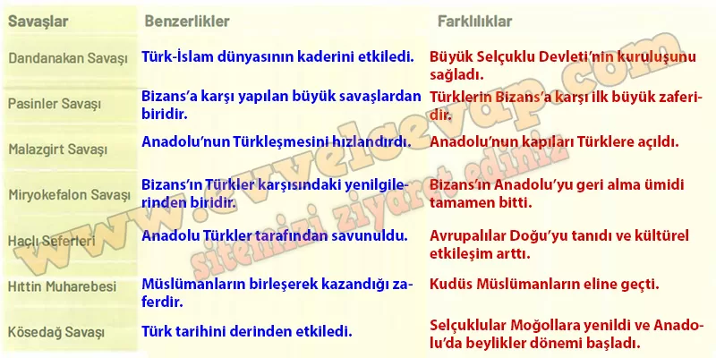
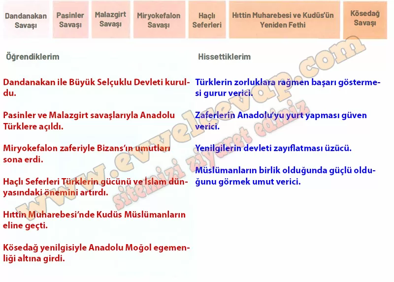

## 10. Sınıf Tarih Ders Kitabı Cevapları Meb Yayınları Sayfa 33

**Soru: Türk tarihinin seyrine etki eden başlıca savaşların benzerlik ve farklılıklarını ilgili alanlara yazınız.**

**Değerlendirelim**

**Soru: 1040-1299 yılları arasında meydana gelen önemli askerî gelişmeler hakkında aşağıdaki formun “Öğrendiklerim” ve “Hissettiklerim” bölümlerini doldurunuz.**

**10. Sınıf Meb Yayınları Tarih Ders Kitabı Sayfa 33**