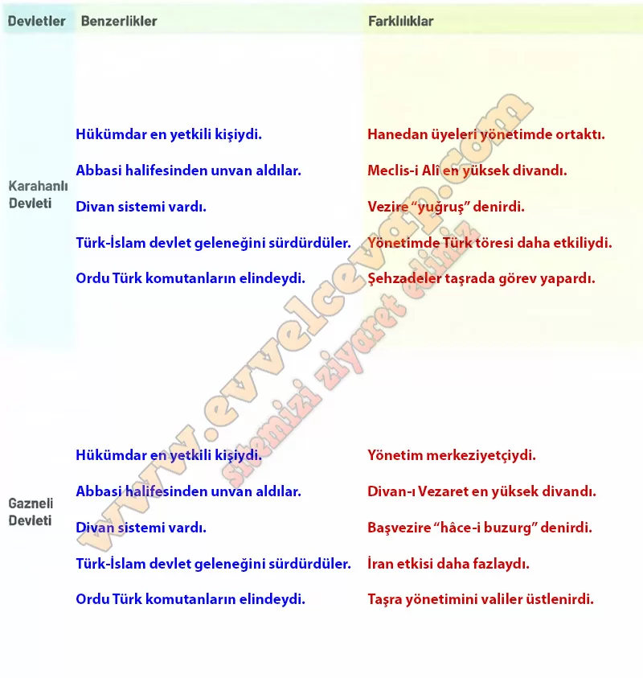

## 10. Sınıf Tarih Ders Kitabı Cevapları Meb Yayınları Sayfa 38

İlk Türk devletlerinde siyasi, askerî, hukuki ve mali meselelerin karara bağlandığı kurultaylar, İslamiyet’in kabulünden sonra divan adını aldı. Bu dönemde devlet yönetimindeki en önemli karar organı Divan-ı A’lâ (Büyük Divan) idi. Karahanlılar Dönemi’nde kurulan Meclis-i Alî, Türkçe ünvanı yuğruş olan bir vezir tarafından yönetilirdi. Gazneliler Dönemi’nde kurulan Divan-ı Vezaretin başında ise hâce-i buzurg (başvezir) adı verilen bir devlet görevlisi bulunuyordu. Ayrıca bu divana bağlı olarak devletin çeşitli işlerinin yürütüldüğü alt divanlar da vardı.

**Soru: Karahanlı ve Gazneli devletlerinin yönetim yapılarıyla ilgili benzerlik ve farklılıkları aşağıdaki tablonun ilgili alanlarına yazınız ve yazdıklarınızı arkadaşlarınızın cevaplarıyla karşılaştırınız.**

**Soru: Türkistan’dan Türkiye’ye uzanan süreçte Büyük Selçuklu ve Türkiye Selçuklu devletlerinin devlet yapıları ve hükümdarlık alametleri ile ilgili verilenlerden yararlanarak soruları cevaplayınız.**

* **Cevap**: **Bu etkinliğin cevabı diğer sayfadadır. (Bkz. sayfa 39)**

**10. Sınıf Meb Yayınları Tarih Ders Kitabı Sayfa 38**