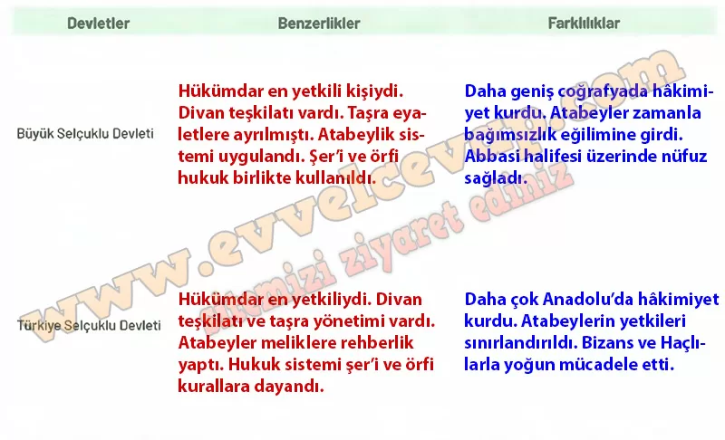

## 10. Sınıf Tarih Ders Kitabı Cevapları Meb Yayınları Sayfa 43

**Soru: Atabeylik uygulamasının güçlü ve zayıf yönlerini aşağıdaki T cetvelinin ilgili alanlarına yazınız.**

**✅Güçlü Yönleri:**

* Meliklerin devlet yönetiminde tecrübe kazanmasını sağladı.
* Eyaletlerin düzenli yönetilmesine katkıda bulundu.
* Devletin taşrada otoritesini güçlendirdi.

**✅Zayıf Yönleri:**

* Bazı atabeyler bulunduğu bölgede bağımsızlık iddia etti.
* Merkezî otoriteyi zayıflattı.
* Devletin dağılma sürecini hızlandırdı.

Türkiye Selçuklu Devleti’nde Büyük Selçuklu Dönemi’ndeki siyasi gelenekler ve teşkilat yapısı büyük ölçüde devam ettirilmekle birlikte Moğol istilaları nedeniyle ve ihtiyaçlar doğrultusunda devlet yönetiminde bazı değişiklikler yapıldı. Türkiye Selçuklu hükümdarları sultan, sultanü’l-a’zam gibi ünvanların yanı sıra sultanu’l-berr ve’l-bahr (kara ve denizin sultanı) ve Farsça sultan anlamına gelen keykubad, keyhüsrev ve keykavus ünvanlarını da kullanmaya başladı. Sultanın başkentte bulunmadığı veya hastalandığı durumlarda ona naib-i saltanat adı verilen devlet görevlileri vekâlet etti. Ayrıca ikta arazilerinin kayıt işlemlerini yürüten, menşur ve beratları hazırlayıp dağıtımını sağlayan pervane adlı görevliler de bu dönemin önemli idari unsurları arasındaydı.

**Soru: Büyük Selçuklu ve Türkiye Selçuklu devletlerinin yönetim yapılarıyla ilgili benzerlik ve farklılıkları aşağıdaki tablonun ilgili alanlarına yazınız ve yazdıklarınızı arkadaşlarınızın cevaplarıyla karşılaştırınız.**

**10. Sınıf Meb Yayınları Tarih Ders Kitabı Sayfa 43**