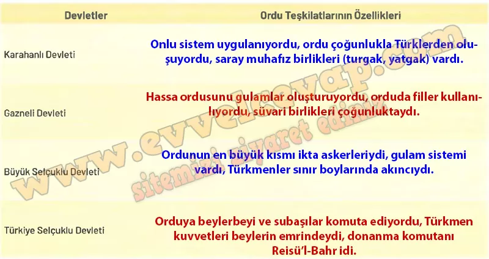

## 10. Sınıf Tarih Ders Kitabı Cevapları Meb Yayınları Sayfa 46

Büyük Selçuklu askerleri savaşlarda ok, yay, kılıç, kalkan, gürz, topuz, nacak, mızrak, hançer gibi hafif silahlar (Görsel 1.13); kale kuşatmalarında ise arrade (taş atan küçük mancınık) ve büyük mancınıklar kullandı. Türkiye Selçukluları ise başlangıçta tabi olduğu Büyük Selçuklu Devleti’nin siyasi ve askerî yapılanmasını örnek aldı ancak ihtiyaçlar ve değişen koşullar neticesinde zamanla bu yapılarda bazı değişiklikler yaptı.

Türkiye Selçuklu ordusunun başkomutanı Beylerbeyi veya Emirü’l-Ümerö unvanı taşırdı. Ordu komutanlarına Subaşı (veya Sipehsalar, serleşker) denirdi. (…) Türkmen kuvvetlerinin başında ise beyler bulunurdu. Selçuklularda donanma komutanlarına Reisü’I-Bahr veya Melikü’s-Sevahiller(Sahiller komutanı) denirdi. Donanma komutanlarına ayrıca Emf- rü’s-Sevahip de denildiğini görüyoruz.”

**Soru: 1) Öğrendiğiniz bilgilerden yararlanarak Karahanlı, Gazneli, Büyük Selçuklu ve Türkiye Selçuklu devletlerindeki ordu teşkilatlarının özelliklerini aşağıdaki tabloya yazınız.**

**Soru: 2) Karahanlı, Gazneli, Büyük Selçuklu ve Türkiye Selçuklu devletlerindeki ordu teşkilatlarında meydana gelen değişim ve sürekliliğin nedenlerini yazınız.**

* **Cevap**: Türk devletlerinde ordular, Mete Han’dan beri devam eden onlu sisteme dayandığı için süreklilik gösterdi. İslamiyet’in kabulüyle gulam sistemi, ikta askerleri ve donanma gibi yeni unsurlar ortaya çıktı. Değişimler, coğrafya, ihtiyaçlar ve dış tehditlere karşı alınan tedbirlerden kaynaklandı.

**10. Sınıf Meb Yayınları Tarih Ders Kitabı Sayfa 46**