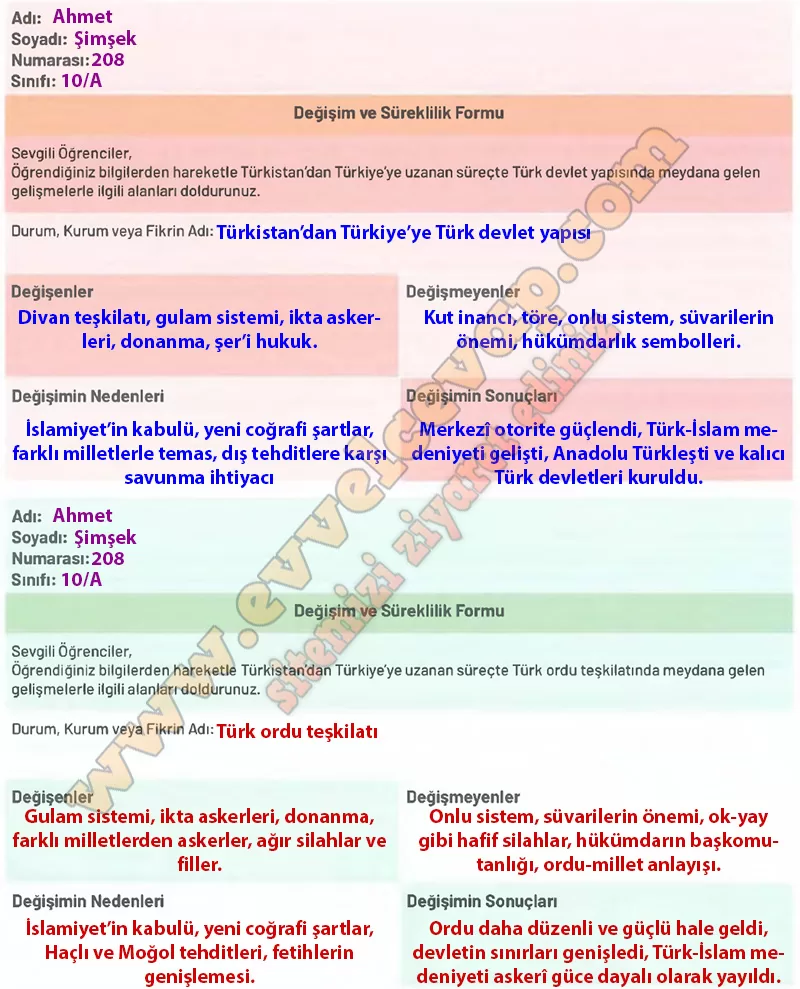

## 10. Sınıf Tarih Ders Kitabı Cevapları Meb Yayınları Sayfa 48

**Değerlendirelim**

**Soru: Aşağıda verilen değişim ve süreklilik formlarını doldurunuz.**

**Soru: Doldurduğunuz formların öğretmeniniz tarafından sayfa 49’da verilen dereceleme ölçeğiyle değerlendirileceğini unutmayınız.**

**10. Sınıf Meb Yayınları Tarih Ders Kitabı Sayfa 48**