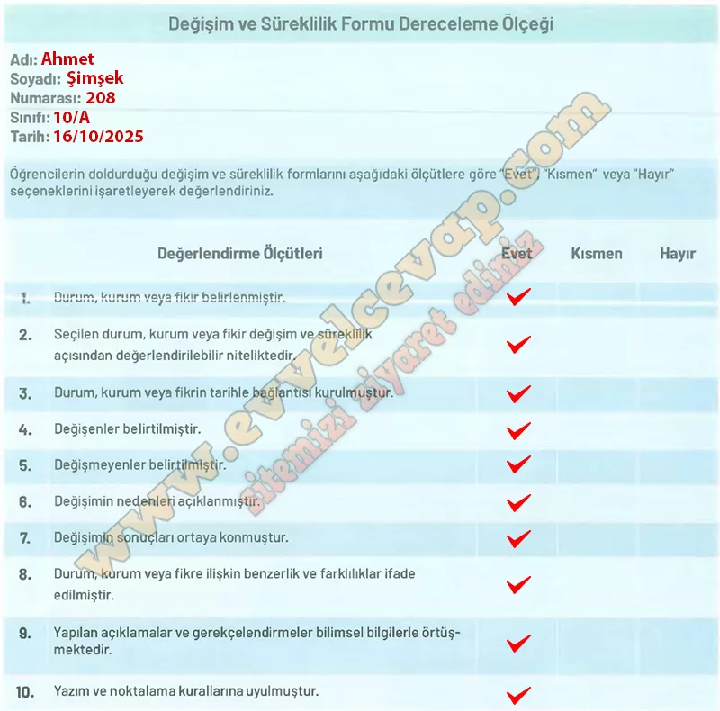

## 10. Sınıf Tarih Ders Kitabı Cevapları Meb Yayınları Sayfa 49

**Soru: Öğrencilerin doldurduğu değişim ve süreklilik formlarını aşağıdaki ölçütlere göre “Evet”, “Kısmen” veya “Hayır” seçeneklerini işaretleyerek değerlendiriniz.**

**Değerlendirme Sistemi**

Dereceleme ölçeğindeki ölçütler için verilen “Evet”, “Kısmen” ve “Hayır” cevapları dikkate alınarak genel bir değerlendirme yapılır. Değerlendirme sonucuna göre öğrenciye dönüt verilir.

**Gelecek Derse Hazırlık**

**Soru: Uygulama adımlarını takip ederek etkinliği yapınız.**

• Öğretmeninizin rehberliğinde eşit sayıda kişiden oluşan gruplara ayrılınız.  
 • Sonraki derse gelmeden önce sayfa 50’deki “Düşünelim” bölümünde verilen konu başlıklarını inceleyiniz.  
 • Araştırmak için bu konu başlıklarından birini seçiniz.  
 • Sayfa 52’deki “Keşfedelim” bölümünde verilen 5N1K etkinliğini yapınız.

**Etkinlik için yapmanız gerekenler**:

* Öğretmeninizin yönlendirmesiyle sınıfta gruplara ayrılın.
* Ders kitabının **sayfa 50’deki “Düşünelim” bölümünde yer alan konu başlıklarını** inceleyin.
* Gruplar halinde bu başlıklardan birini seçin (örneğin: Selçuklu dönemi mimarisi, ticaret yolları, sanat eserleri, para sistemi gibi).
* Seçtiğiniz konuyla ilgili kısa bir araştırma yapın ve notlar alın.
* Sonraki derse bu notlarla gelerek grupça sınıfta paylaşmaya hazır olun.

**10. Sınıf Meb Yayınları Tarih Ders Kitabı Sayfa 49**