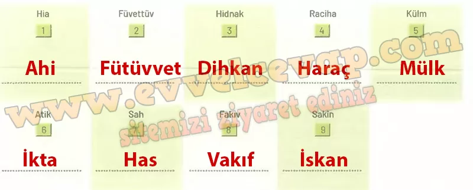

## 10. Sınıf Tarih Ders Kitabı Cevapları Meb Yayınları Sayfa 52

**Keşfedelim**

**Soru: Verilen yönergeler doğrultusunda aşağıdaki etkinlikleri yapınız.**

**Soru: Uygulama adımlarını takip ederek SN1K etkinliğini gerçekleştiriniz.**

Öğretmeninizin rehberliğinde eşit sayıda kişiden oluşan gruplara ayrılınız.  
 • “Düşünelim” bölümünde ürettiğiniz sorulardan yola çıkarak incelemek istediğiniz konu başlığını (sosyoekonomik hayat, yerleşme, şehirleşme) grup arkadaşlarınızla paylaşınız.  
 • Grubunuzla birlikte 5NlK tekniğini kullanarak Türkistan’dan Türkiye’ye uzanan süreçte Türklerin sosyoekonomik faaliyetleri ile yerleşme ve şehirleşme anlayışları arasındaki ilişki hakkında ürettiğiniz sorulara cevap bulmak için basılı ve dijital kaynaklardan bilgi toplayınız.  
 • Genel ağ üzerinden araştırma yaparken ilgili sitenin dijital kimliğini veya uzantısının güvenilirliğini kontrol etmeyi unutmayınız.  
 • Ürettiğiniz soruları grup arkadaşlarınızla birlikte cevaplayınız.  
 • Etkinlik süresince edindiğiniz bilgileri gözden geçirerek aşağıdaki alana araştırma raporunuzu yazınız.

**Araştırma Raporum**:

Türkler, Türkistan’dan Türkiye’ye uzanan süreçte konar-göçer hayattan yerleşik düzene geçmiştir. Bu süreçte ticaret yolları üzerinde şehirler kurarak ekonomik hayatı canlandırmışlardır. Kervansaraylar, ribatlar ve pazarlar ticaretin güvenliğini sağlamıştır. Saray, cami, medrese gibi yapılar şehirleşmeyi hızlandırmıştır. Tarım, hayvancılık ve el sanatları halkın geçim kaynaklarını oluşturmuştur. Kullanılan paralar ekonomik düzeni güçlendirmiştir. Sonuç olarak Türkler, siyasi ve kültürel gelişmelerle birlikte sosyoekonomik hayatta da güçlü bir medeniyet kurmuşlardır.

**Soru: Uygulama adımlarını takip ederek kavram öğretim materyali anagram bulmacayı çözünüz.**

Aşağıdaki kutucuklarda Selçukluların toprak ve ekonomi yönetimiyle ilgili bazı kavramlar verilmiştir.

• Anagramları çözerek kavramların doğru yazılışını bulunuz.  
 • Kavramların her birini cümle içinde kullanınız.

1. XIII. yüzyılda Anadolu’da ortaya çıkan ve Osmanlı Devleti’nin kurulmasında önemli rol oynayan dinî ve toplumsal kuruluş.  
 2. Başlangıçta tasavvufi mahiyet taşırken XIII. yüzyıldan itibaren toplumsal, ekonomik ve siyasi bir yapılanmaya dönüşen kurum.  
 3. Köylerin idaresinden sorumlu olan yönetici.  
 4. Gayrimüslimlerin arazilerinden yaşama ve himaye edilme hakkı karşılığında alınan vergi.  
 5. Hükümdarın liyakat sahibi devlet adamlarına, dinî ve kültürel alanlarda hizmet veren kimselere mirî araziden tahsis ettiği toprak.  
 6. Hazineye ait topraklardan toplanan vergi ya da gelirlerin o topraklarla ilgilenen askerlere ve memurlara hizmetleri karşılığında maaş olarak verilmesi.  
 7. Hükümdara, hanedan mensuplarına ve üst düzey devlet görevlilerine ait mülk ve arazilerden elde edilen yıllık gelir.  
 8. İslam dünyasında birlik, beraberlik ve dayanışma bilincini canlı tutmak amacıyla oluşturulan hayır kurumu.  
 9. Bir kimseyi sürekli ikamet etmek üzere bir yere yerleştirmek, yurt edindirmek.

**10. Sınıf Meb Yayınları Tarih Ders Kitabı Sayfa 52**