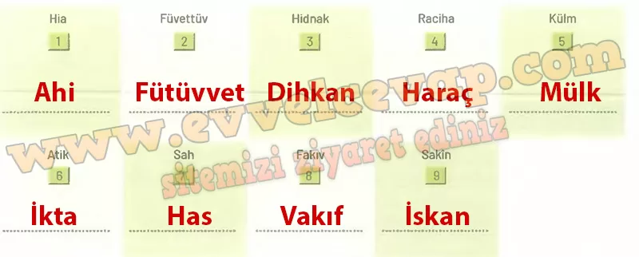

## 10. Sınıf Tarih Ders Kitabı Cevapları Meb Yayınları Sayfa 53

**Öğrenelim**

**Soru: Verilen yönergeler doğrultusunda aşağıdaki etkinlikleri yapınız.**

**Soru: 1040-1299 yıllan arasında Türklerin sosyoekonomik faaliyetleri ile ilgili verilenlerden yararlanarak soruları cevaplayınız.**

Toplumların hayatı geçmişten getirdikleri kültürel özellikler, yaşadıkları bölgenin coğrafi koşulları ve sahip oldukları inançlar çerçevesinde şekillenir. Selçuklu toplumu da Türkistan’daki örf ve âdetlerini İslamiyet’le ve fethettikleri yeni topraklarda karşılaştıkları kültürlerle sentezleyerek güçlü bir sosyoekonomik sistem kurmuştur.

Selçuklu toplumu yönetenler ve yönetilenler şeklinde ikiye ayrılır, toplumunun temelini ise aile kurumu oluştururdu.

Aile bireyleri arasında karşılıklı sevgi, saygı ve hoşgörü hâkimdi. Ailelerin yaşadığı evler oda, sofa, mutfak gibi çeşitli bölümlerden oluşurdu. Selçuklu kadınları sosyal ve kültürel anlamda hayatın içindeydi. Kadınlar saçlarını örerek omuzlarından sarkıtır, saç süsü olarak da genellikle takma zülüf kullanırdı (Görsel 1.14). Çocuk sahibi olmanın bir statü sembolü olarak görüldüğü Selçuklu toplumunda doğumlardan sonra kutlamalar yapılır ve erkek çocukları için sünnet törenleri düzenlenirdi. Sosyal hayatta komşuluk ilişkilerine büyük önem verilir, hayatın her alanında yardımlaşma ve dayanışma ruhu canlı tutulurdu. Halk dinî  
 bayramları, baharın müjdecisi olan Nevruz Bayramı’nı ve hükümdarın tahta çıkışını büyük bir coşkuyla kutlardı. Ayrıca avcılık, atıcılık, at biniciliği, güreş, cirit gibi sportif faaliyetler düzenlenir, çevgen (çevgân) oyunu oynanır ve yarışlar yapılırdı.

* **Cevap**: **Bu etkinliğin cevabı diğer sayfadadır. (Bkz. sayfa 55)**

**10. Sınıf Meb Yayınları Tarih Ders Kitabı Sayfa 53**