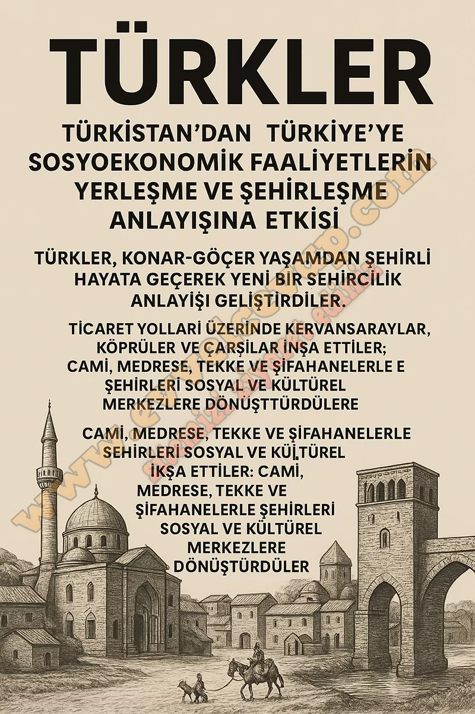

## 10. Sınıf Tarih Ders Kitabı Cevapları Meb Yayınları Sayfa 64

• Öğretmeninizin rehberliğinde eşit sayıda kişiden oluşan gruplara ayrılınız.  
 • Grup arkadaşlarınızla iş bölümü yapınız.  
 • Genel ağ kaynakları üzerinden broşür hazırlama yöntemleri hakkında bilgi toplayınız.  
 • Yapacağınız çalışmayla ilgili resim, metin, tablo, ses dosyası, video vb. içerikler hazırlayınız.  
 • Konuyla ilgili araştırma yaparken güvenilir genel ağ sitelerinden, kütüphane veri tabanlarından ve akademik platformlardan yararlanınız.  
 • Hazırlayacağınız broşürün özgün ve ilgi çekici olmasına dikkat ediniz.  
 • Broşürünüzde yazım ve noktalama kurallarına uyunuz, yalın ve anlaşılır bir dil kullanınız.  
 • Dijital ortamda ya da basılı olarak hazırladığınız broşürü sınıf arkadaşlarınıza sununuz.  
 • Sunum sırasında etkili iletişim yöntemlerini kullanmaya özen gösteriniz.

**TÜRKİSTAN’DAN TÜRKİYE’YE: SOSYOEKONOMİK HAYAT VE ŞEHİRLEŞME**

**✅ 1. Giriş**

Türkler, Türkistan’dan Anadolu’ya uzanan süreçte göçlerle birlikte yeni bir yerleşme ve şehirleşme anlayışı geliştirmiştir. Sosyoekonomik faaliyetler bu değişimin temelinde yer almıştır.

**✅ 2. Sosyoekonomik Faaliyetler**

* **Tarım ve Hayvancılık:** Geçim kaynağı olmuş, Anadolu’daki verimli topraklarda gelişmiştir.
* **Ticaret:** Kervan yolları, panayırlar (Yabanlu Panayırı), kervansaraylar ile canlanmıştır.
* **Zanaat ve El Sanatları:** Halıcılık, dokumacılık, maden işçiliği gelişmiştir.
* **Ahilik Teşkilatı:** Esnaf ve zanaatkârlar arasında dayanışma ve kaliteyi sağlamıştır.

**✅ 3. Yerleşme ve Şehirleşme**

* Anadolu’da Konya, Kayseri, Aksaray gibi merkezler imar edilmiştir.
* Cami, medrese, şifahane, tekke, çarşı ve hanlar şehirlerin merkezinde yer almıştır.
* Şehirler sosyal, kültürel ve ekonomik merkezler haline gelmiştir.

---

**✅ 4. İlişki ve Sonuç**

* Sosyoekonomik faaliyetler şehirlerin büyümesini sağlamış; şehirleşme de ekonomik hayatı güçlendirmiştir. Bu karşılıklı etkileşim Türk-İslam medeniyetine özgü yeni bir şehir kültürü doğurmuştur.

---

✅ **Öz Değerlendirme (Sayfa 64 için örnek):**

* Konuyu araştırırken güvenilir kaynaklar kullandım.
* Broşürümü görsel ve yazılı bilgilerle zenginleştirdim.
* Bilgileri düzenli ve anlaşılır bir biçimde aktardım.
* Çalışmamı zamanında tamamladım.
* Grup arkadaşlarımla işbirliği yaptım.

---

📌 **Analitik Dereceli Puanlama Anahtarı (Sayfa 65’e göre dikkat ettiklerim):**

* **İçerik:** Konuyu doğru ve eksiksiz anlattım.
* **Düzen:** Bilgileri broşür formatında açıkça sundum.
* **Görsellik:** Harita, resim ve şekillerle destekledim.
* **Dil ve Anlatım:** Açık, anlaşılır ve öğrenci seviyesine uygun yazdım.

**Değerlendirelim**

Öğrencinin Adı ve Soyadı:  
 Numarası ve Sınıfı:

**Soru: Aşağıdaki ifadeler yaptığınız çalışmayla ilgili kendinizi değerlendirmeniz için düzenlenmiştir. Bu ifadeler size uygunsa “Evet”i, biraz uygunsa “Kısmen”i, uygun değilse “Hayır”ı işaretleyiniz. Tüm ifadeleri işaretlemeyi unutmayınız.**

**Soru: Aşağıdaki alanlara sizden istenenler doğrultusunda uygun ifadeleri yazınız.**

**✅Bu çalışmada en çok ilgimi çeken konular şunlardı**: Bu çalışmada en çok ilgimi çeken konular şunlardı: Türklerin göç ettikleri yerlerde şehir kültürü geliştirmesi ilgimi çekti. Kervansarayların ticareti nasıl canlandırdığı dikkatimi çekti. Ahilik teşkilatının esnaf hayatındaki rolü ilgimi çekti. Selçukluların inşa ettiği cami, medrese ve şifahaneler çok dikkatimi çekti.

**✅Bu çalışmayı yaparken en çok zorlandığım konular şunlardı**: Bu çalışmayı yaparken en çok zorlandığım konular şunlardı: Farklı kaynaklardan bilgi toplayıp düzenlemek beni zorladı. Topladığım bilgileri kısa ve öz şekilde yazmakta zorlandım. Görselleri seçerken hangisinin daha uygun olduğuna karar vermek zor oldu. Broşürü düzenlerken bilgileri sıralı ve anlaşılır hale getirmekte zorlandım.

**10. Sınıf Meb Yayınları Tarih Ders Kitabı Sayfa 64**