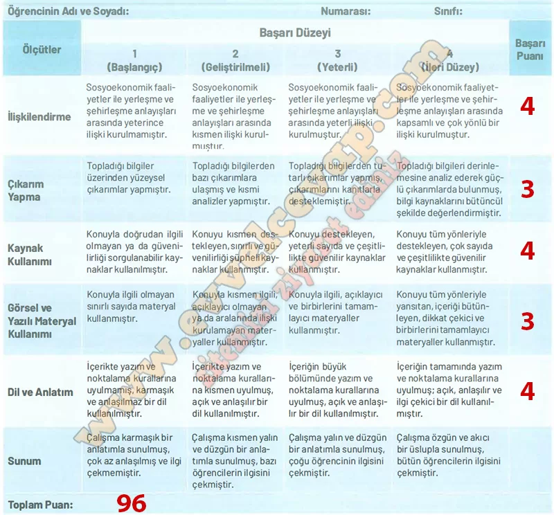

## 10. Sınıf Tarih Ders Kitabı Cevapları Meb Yayınları Sayfa 65

**Analitik Dereceli Puanlama Anahtarı**

Aşağıdaki analitik dereceli puanlama anahtarı, Türkistan’dan Türkiye’ye uzanan süreçte Türklerin sosyoekonomik faaliyetleri ile yerleşme ve şehirleşme anlayışları arasındaki ilişkiyi ortaya koymak için hazırladığınız basılı ya da dijital broşürü değerlendirmek için düzenlenmiştir. Bu anahtar, broşürünüzü hazırlarken hangi ölçütlere dikkat etmeniz gerektiği konusunda da size bilgi vermektedir.

**Değerlendirme Sistemi**

Analitik dereceli puanlama anahtarından alınan puan 100’lük sisteme dönüştürülür. Örneğin bu anahtarda altı ölçüt (ilişkilendirme, çıkarım yapma, kaynak kullanımı, görsel ve yazılı materyal kullanımı, dil ve anlatım, sunum) ve dört performans düzeyi (başlangıç, geliştirilmeli, yeterli, ileri düzey) bulunmaktadır. Bu durumda her ölçütten alınabilecek en yüksek puan 4, öğrencinin alabileceği en yüksek puan ise 4 x 6=24 olacaktır. Öğrencinin analitik dereceli puanlama anahtarından aldığı puan, bu en yüksek puana bölünüp 100 ile çarpılarak yüzdelik sisteme dönüştürülür. Bir öğrenci değerlendirmeden 12 puan aldıysa yüzdelik puanı (12/24) x 100=%50 edecek, bu durumda öğrenci 100’lük sistemde 50 puan almış olacaktır.

**Gelecek Derse Hazırlık**

**Soru: Sonraki derse gelirken yanınızda sayfa 68’deki “Keşfedelim” bölümünde verilen etkinlik için öğretmenizin belirlediği malzemeleri getiriniz.**

* **Cevap**: “Keşfedelim” bölümünde verilen etkinlik için öğretmenizin belirlediği malzemeleri sınıfınıza getirebilirsiniz.

**10. Sınıf Meb Yayınları Tarih Ders Kitabı Sayfa 65**