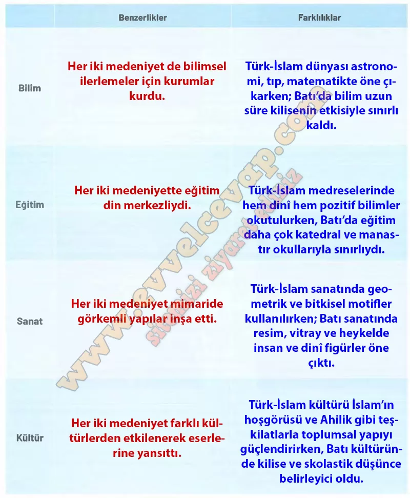

## 10. Sınıf Tarih Ders Kitabı Cevapları Meb Yayınları Sayfa 84

**Soru: Uygulama adımlarını takip ederek ve düşün-eşleş-paylaş tekniğini kullanarak etkinliği gerçekleştiriniz.**

• Edindiğiniz bilgilerden yola çıkarak Türk-İslam ve Batı medeniyetlerindeki bilim, kültür, eğitim ve sanat anlayışlarının benzerlik ve farklılıkları hakkında düşününüz.  
 • Öğretmeniniz rehberliğinde rastgele eşleştiğiniz arkadaşınızla düşüncelerinizi paylaşınız.  
 • XI-XIII. yüzyıllarda Türk-İslam ve Batı medeniyetlerindeki bilim, kültür, eğitim ve sanat anlayışlarının benzerlik ve farklılıkları ile ilgili çıkarımlarınızı aşağıda verilen tabloya yazarak sınıftaki arkadaşlarınızla paylaşınız.

**10. Sınıf Meb Yayınları Tarih Ders Kitabı Sayfa 84**