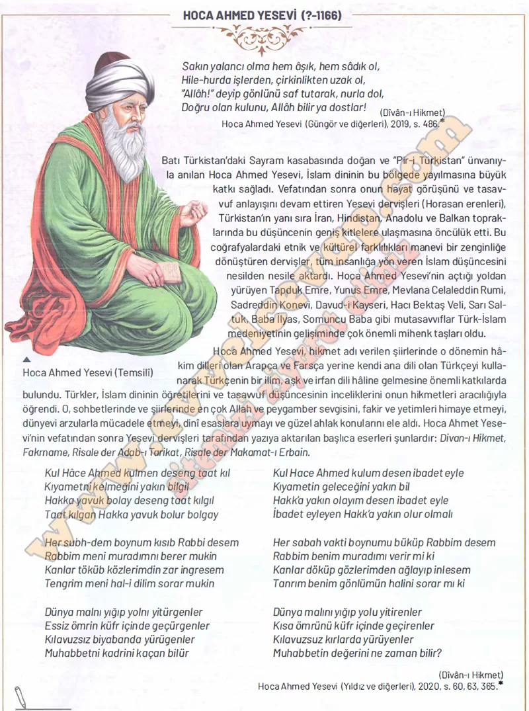

## 10. Sınıf Tarih Ders Kitabı Cevapları Meb Yayınları Sayfa 86

**Soru: Hoca Ahmed Yesevi’nin şiirlerinden çıkarılabilecek üç ilke yazınız.**

✅Doğruluk ve güzel ahlak sahibi olmak.

✅Allah’a yakın olmak için ibadet etmek.

✅Dünya malına aldanmayıp sevgi ve maneviyata değer vermek.

**10. Sınıf Meb Yayınları Tarih Ders Kitabı Sayfa 86**