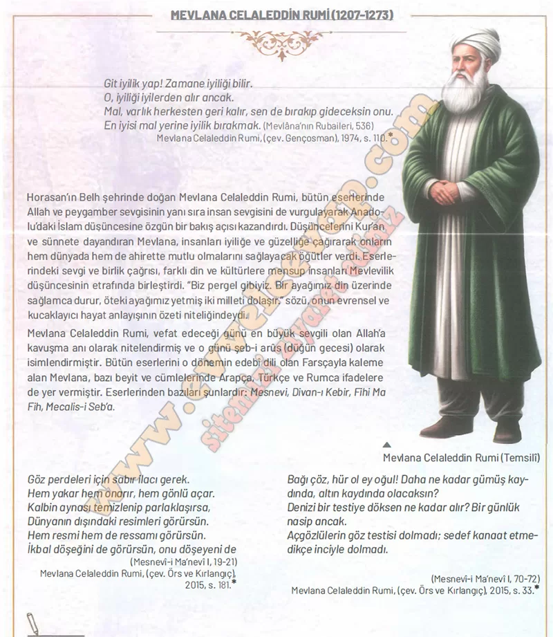

## 10. Sınıf Tarih Ders Kitabı Cevapları Meb Yayınları Sayfa 87

**✅Sabır:** Sabır insanın gönlünü temizler ve iyiliğe yöneltir.

**✅Özgürlük:** İnsan hırslardan kurtulursa gerçek özgürlüğe ulaşır.

**✅Kanaat:** Kanaat eden kişi huzurlu olur ve mutluluğu bulur.

**10. Sınıf Meb Yayınları Tarih Ders Kitabı Sayfa 87**