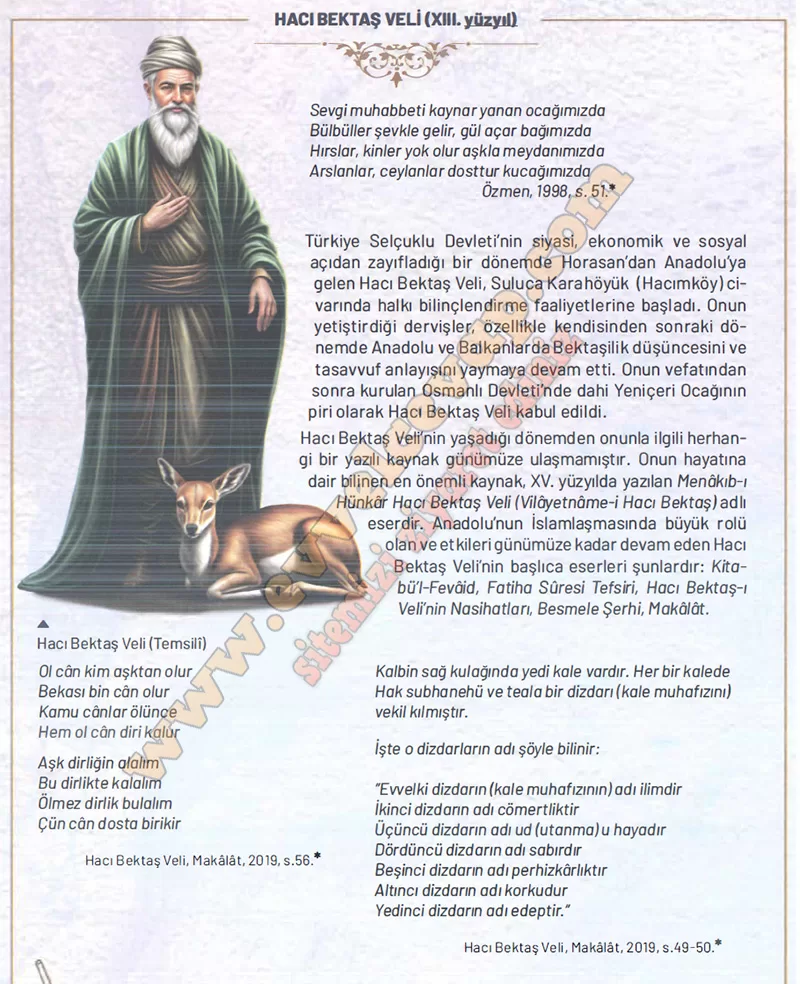

## 10. Sınıf Tarih Ders Kitabı Cevapları Meb Yayınları Sayfa 88

**Soru: Hacı Bektaş Veli’nin öğretilerinden kendiniz için önemli gördüğünüz üç öğüt yazınız.**

✅**İlim** öğrenerek hayatımı güzelleştirmeliyim.

✅**Sabırlı ve cömert** olmalıyım.

✅**Edep ve haya** ile insanlara örnek olmalıyım.

**10. Sınıf Meb Yayınları Tarih Ders Kitabı Sayfa 88**