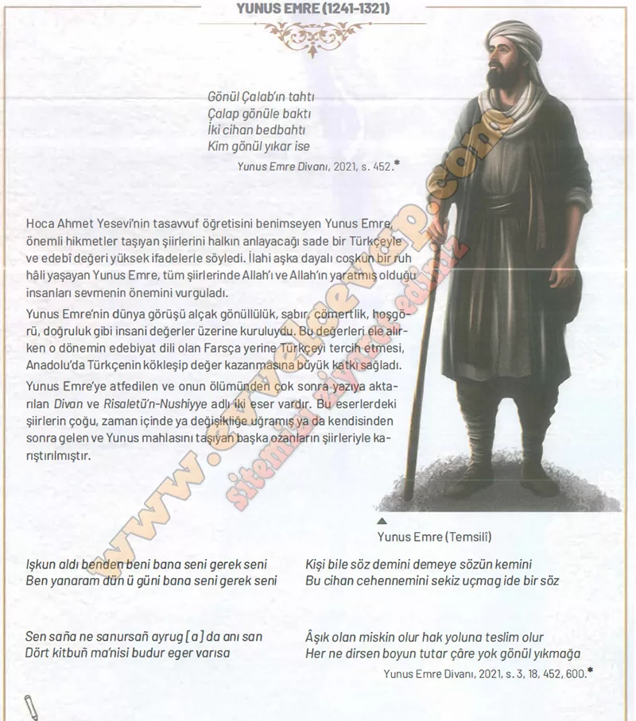

## 10. Sınıf Tarih Ders Kitabı Cevapları Meb Yayınları Sayfa 89

**Soru: Yunus Emre, bu şiirlerde hangi değerleri vurgulamaktadır? Bu değerlerle ilgili birer cümle yazınız.**

**✅Allah aşkı:** İnsan, gerçek huzuru Allah sevgisinde bulur.

**✅Doğru söz:** Bir söz, insanları mutlu da edebilir, üzebilir.

**✅Hoşgörü:** Gönül kırmamak ve insanları incitmemek gerekir.

**✅Teslimiyet:** Hak yoluna giren kişi sabırla ve teslimiyetle yaşar.

**10. Sınıf Meb Yayınları Tarih Ders Kitabı Sayfa 89**