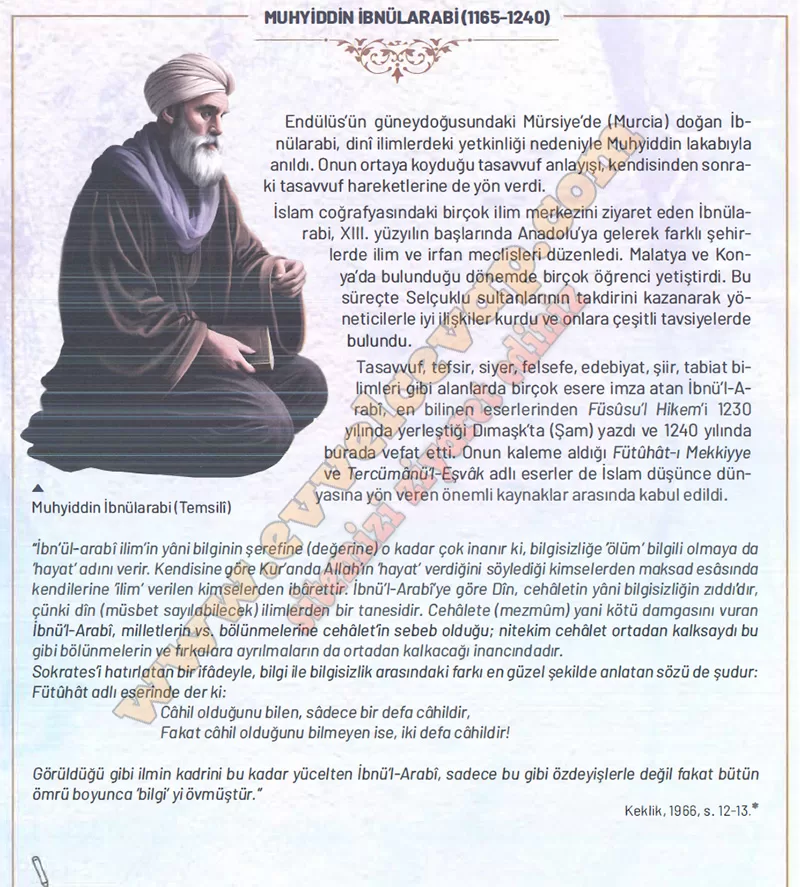

## 10. Sınıf Tarih Ders Kitabı Cevapları Meb Yayınları Sayfa 90

**Soru: Hoca Ahmed Yesevi, Mevtana Cetateddin Rumi, Hacı Bektaş Veli, Yunus Emre ve Muhyiddin tbnü’i-A- rabi’nin evrensel düşüncelerinden hareketle bir dörtlük yazınız.**

Sevgiyle yoğrulsun gönüller daima,  
Doğruluk, sabır olsun her adımda.  
Bilgiyle aydınlansın karanlık yollar,  
Hoşgörüyle birleşsin tüm insanlar.

**10. Sınıf Meb Yayınları Tarih Ders Kitabı Sayfa 90**