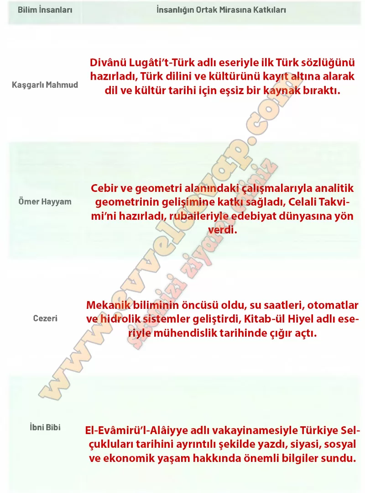

## 10. Sınıf Tarih Ders Kitabı Cevapları Meb Yayınları Sayfa 96

**Soru: Tabloda adı geçen bilim insanlarının insanlığın ortak mirasına katkılarını ilgili alanlara yazınız.**

**10. Sınıf Meb Yayınları Tarih Ders Kitabı Sayfa 96**