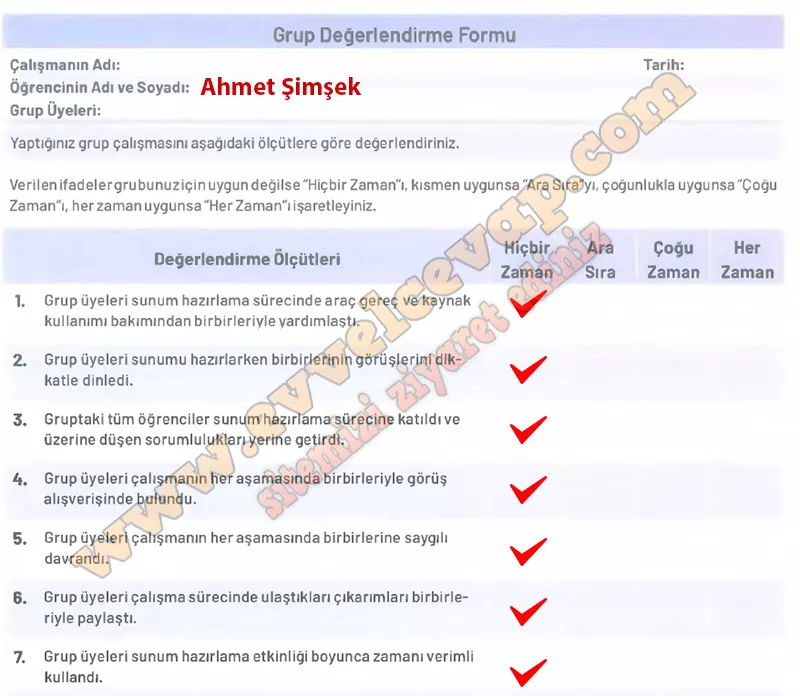

## 10. Sınıf Tarih Ders Kitabı Cevapları Meb Yayınları Sayfa 99

**Grup Değerlendirme Formu**

**Soru: Grubunuzun güçlü yanları nelerdi?**

* **Cevap**: İşbirliği yapmamız ve birbirimize saygılı davranmamız. Kaynakları paylaşmamız ve ortak fikir üretmemiz. Çalışmada herkesin farklı bir katkı sunması.

**Soru: Grubunuz bu etkinlik sırasında hangi zorluklarla karşılaştı?**

* **Cevap**: Zamanı planlamakta bazen zorlandık. Görüş ayrılıkları nedeniyle karar almak biraz uzun sürdü. Sunumu hazırlarken teknik araçları kullanmada küçük sıkıntılar yaşadık.

**Soru: Grup olarak daha nitelikli çalışmalara imza atmak için neler önerirsiniz?**

* **Cevap**: Zaman planlamasını daha dikkatli yapmalıyız. Görev dağılımını daha net belirlemeliyiz. Daha çok kaynak taraması yaparak bilgileri çeşitlendirmeliyiz.

**Soru: Öğretmenin geri bildirimi**

* **Cevap**:  Grubunuz çalışmada işbirliği ve saygı açısından oldukça başarılı. Zaman yönetimi ve görev dağılımını geliştirdiğinizde daha verimli çalışmalar ortaya koyabilirsiniz. 👏

**10. Sınıf Meb Yayınları Tarih Ders Kitabı Sayfa 99**